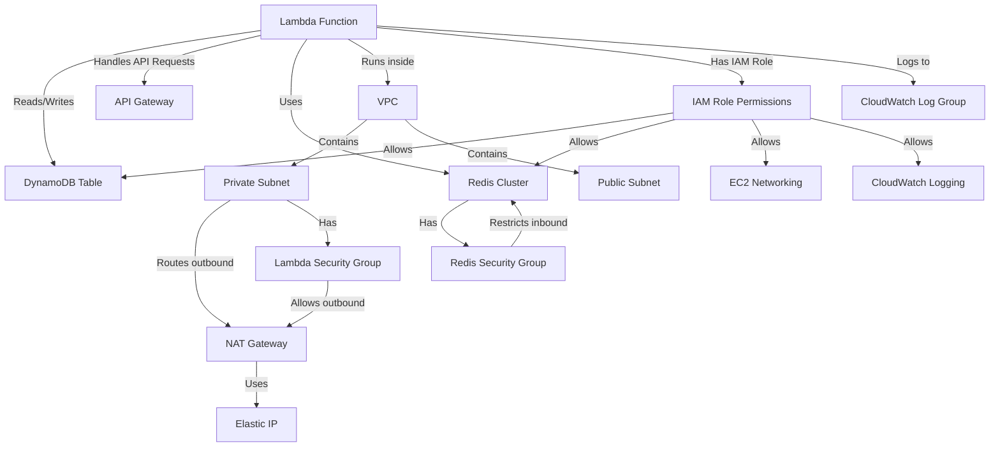

# Description of AWS serverless configuration



# Logging lambda function logging

```
aws logs tail /aws/lambda/trackapi-lambda-default-app --follow
```

# Serverless.yml Configuration Explanation

| Configuration                                                                | Description                                                          |
|------------------------------------------------------------------------------|----------------------------------------------------------------------|
| `service: trackapi-lambda`                                                   | Defines the name of your serverless service/project                  |
| **Provider Section**                                                         |                                                                      |
| `provider:`                                                                  | Main section that configures the cloud provider and general settings |
| `  name: aws`                                                                | Specifies AWS as the cloud provider                                  |
| `  runtime: python3.13`                                                      | Sets Python 3.13 as the runtime environment for Lambda functions     |
| `  region: eu-central-1`                                                     | Specifies the AWS region for deployment (Frankfurt)                  |
| `  stage: default`                                                           | Sets the deployment stage name (used for namespacing resources)      |
| `  memorySize: 1024`                                                         | Allocates 1024MB of memory for Lambda functions                      |
| `  timeout: 60`                                                              | Sets the global timeout for functions to 60 seconds                  |
| `  httpApi:`                                                                 | Configuration for HTTP API Gateway                                   |
| `    cors: true`                                                             | Enables Cross-Origin Resource Sharing for API endpoints              |
| `  environment:`                                                             | Defines environment variables available to Lambda functions          |
| `    STAGE: ${self:provider.stage}`                                          | Sets STAGE variable to the current deployment stage                  |
| `    WEATHERBIT_API_KEY: ${env:WEATHERBIT_API_KEY, ''}`                      | API key for WeatherBit, fetched from environment variables           |
| `    WEATHERBIT_API_URL: https://api.weatherbit.io/v2.0/current`             | URL for the WeatherBit API                                           |
| `    EXT_API_EXPIRATION: 7200`                                               | Sets external API cache expiration time to 7200 seconds              |
| `    TRACKING_TABLE: Tracking`                                               | Name of the DynamoDB table for tracking data                         |
| `    REDIS_HOST: !GetAtt MyRedisCluster.RedisEndpoint.Address`               | Gets Redis host address from the Redis cluster resource              |
| `  iamRoleStatements:`                                                       | Defines IAM permissions for Lambda execution role                    |
| `    - Effect: Allow`                                                        | Permission block for DynamoDB                                        |
| `      Action:`                                                              | List of allowed DynamoDB actions                                     |
| `        - dynamodb:GetItem`                                                 | Permission to get single items from DynamoDB                         |
| `        - dynamodb:Query`                                                   | Permission to query DynamoDB tables                                  |
| `        - dynamodb:Scan`                                                    | Permission to scan DynamoDB tables                                   |
| `      Resource:`                                                            | Resources these permissions apply to                                 |
| `        - "arn:aws:dynamodb:${self:provider.region}:*:table/Tracking"`      | ARN for the Tracking DynamoDB table                                  |
| `    - Effect: Allow`                                                        | Permission block for CloudWatch Logs                                 |
| `      Action:`                                                              | List of allowed CloudWatch Logs actions                              |
| `        - logs:CreateLogGroup`                                              | Permission to create log groups                                      |
| `        - logs:CreateLogStream`                                             | Permission to create log streams                                     |
| `        - logs:PutLogEvents`                                                | Permission to write log events                                       |
| `      Resource:`                                                            | Resources these permissions apply to                                 |
| `        - "arn:aws:logs:${self:provider.region}:*:log-group:/aws/lambda/*"` | ARN pattern for Lambda log groups                                    |
| `    - Effect: Allow`                                                        | Permission block for EC2 network interfaces                          |
| `      Action:`                                                              | List of allowed EC2 network interface actions                        |
| `        - ec2:CreateNetworkInterface`                                       | Permission to create network interfaces (needed for VPC)             |
| `        - ec2:DescribeNetworkInterfaces`                                    | Permission to describe network interfaces                            |
| `        - ec2:DeleteNetworkInterface`                                       | Permission to delete network interfaces                              |
| `        - ec2:AssignPrivateIpAddresses`                                     | Permission to assign private IP addresses                            |
| `        - ec2:UnassignPrivateIpAddresses`                                   | Permission to unassign private IP addresses                          |
| `      Resource: "*"`                                                        | Applies to all resources                                             |
| `    - Effect: Allow`                                                        | Permission block for Elastic IP operations                           |
| `      Action:`                                                              | List of allowed Elastic IP actions                                   |
| `        - ec2:AssociateAddress`                                             | Permission to associate Elastic IPs                                  |
| `        - ec2:DisassociateAddress`                                          | Permission to disassociate Elastic IPs                               |
| `        - ec2:ReleaseAddress`                                               | Permission to release Elastic IPs                                    |
| `        - ec2:AllocateAddress`                                              | Permission to allocate Elastic IPs                                   |
| `        - ec2:DescribeAddresses`                                            | Permission to describe Elastic IPs                                   |
| `      Resource: "*"`                                                        | Applies to all resources                                             |
| `  vpc:`                                                                     | VPC configuration for Lambda functions                               |
| `    securityGroupIds:`                                                      | Security groups to attach to Lambda                                  |
| `      - !Ref LambdaSecurityGroup`                                           | Reference to the Lambda security group defined in Resources          |
| `    subnetIds:`                                                             | Subnets to deploy Lambda in                                          |
| `      - subnet-049bae75658b314e9`                                           | ID of a specific subnet                                              |
| **Package Section**                                                          |                                                                      |
| `package:`                                                                   | Configures how the Lambda function is packaged                       |
| `  patterns:`                                                                | File patterns for inclusion/exclusion                                |
| `    - '!node_modules/**'`                                                   | Excludes node_modules directory                                      |
| `    - '!venv/**'`                                                           | Excludes Python virtual environment directory                        |
| `    - '!.venv/**'`                                                          | Excludes alternative Python virtual environment directory            |
| `    - '!.env*'`                                                             | Excludes environment files                                           |
| `    - '.idea/**'`                                                           | Includes IDE configuration files                                     |
| `    - '.pytest_cache/**'`                                                   | Includes pytest cache directory                                      |
| `    - 'app/**'`                                                             | Includes the application code directory                              |
| **Functions Section**                                                        |                                                                      |
| `functions:`                                                                 | Defines Lambda functions                                             |
| `  app:`                                                                     | The main application function                                        |
| `    handler: app.main.handler`                                              | Path to the handler function                                         |
| `    memorySize: 1024`                                                       | Allocates 1024MB of memory for this function                         |
| `    timeout: 15`                                                            | Sets timeout to 15 seconds                                           |
| `    layers:`                                                                | Lambda layers to include                                             |
| `      - !Ref PythonRequirementsLambdaLayer`                                 | References the Python requirements layer                             |
| `    events:`                                                                | Events that trigger this function                                    |
| `      - httpApi:`                                                           | HTTP API event configuration                                         |
| `          path: /`                                                          | Root path endpoint                                                   |
| `          method: ANY`                                                      | Accepts any HTTP method                                              |
| `      - httpApi:`                                                           | Additional HTTP API event                                            |
| `          path: /{proxy+}`                                                  | Proxy path for all other routes                                      |
| `          method: ANY`                                                      | Accepts any HTTP method                                              |
| **Resources Section**                                                        |                                                                      |
| `resources:`                                                                 | CloudFormation resources to create                                   |
| `  Resources:`                                                               | Container for CloudFormation resources                               |
| `    RedisSecurityGroup:`                                                    | Security group for Redis cluster                                     |
| `      Type: AWS::EC2::SecurityGroup`                                        | CloudFormation resource type                                         |
| `      Properties:`                                                          | Resource properties                                                  |
| `        GroupDescription: "Security group for Redis"`                       | Description of the security group                                    |
| `        VpcId: vpc-0aa1e080ebd61ac52`                                       | ID of the VPC                                                        |
| `        SecurityGroupIngress:`                                              | Inbound traffic rules                                                |
| `          - IpProtocol: tcp`                                                | TCP protocol                                                         |
| `            FromPort: 6379`                                                 | Redis port start                                                     |
| `            ToPort: 6379`                                                   | Redis port end                                                       |
| `            CidrIp: 172.31.0.0/16`                                          | CIDR block for VPC internal traffic                                  |
| `    LambdaSecurityGroup:`                                                   | Security group for Lambda                                            |
| `      Type: AWS::EC2::SecurityGroup`                                        | CloudFormation resource type                                         |
| `      Properties:`                                                          | Resource properties                                                  |
| `        GroupDescription: "Security group for Lambda function"`             | Description of the security group                                    |
| `        VpcId: vpc-0aa1e080ebd61ac52`                                       | ID of the VPC                                                        |
| `        SecurityGroupIngress:`                                              | Inbound traffic rules                                                |
| `          - IpProtocol: tcp`                                                | TCP protocol                                                         |
| `            FromPort: 443`                                                  | HTTPS port start                                                     |
| `            ToPort: 443`                                                    | HTTPS port end                                                       |
| `            CidrIp: 0.0.0.0/0`                                              | Allow from any IP                                                    |
| `        SecurityGroupEgress:`                                               | Outbound traffic rules                                               |
| `          - IpProtocol: "-1"`                                               | All protocols                                                        |
| `            CidrIp: "0.0.0.0/0"`                                            | Allow to any IP                                                      |
| `    TrackingRecordsTable:`                                                  | DynamoDB table definition                                            |
| `      Type: AWS::DynamoDB::Table`                                           | CloudFormation resource type                                         |
| `      Properties:`                                                          | Resource properties                                                  |
| `        TableName: Tracking`                                                | Name of the table                                                    |
| `        BillingMode: PAY_PER_REQUEST`                                       | On-demand capacity mode                                              |
| `        AttributeDefinitions:`                                              | Table attribute definitions                                          |
| `          - AttributeName: tracking_number`                                 | First attribute name                                                 |
| `            AttributeType: S`                                               | String type                                                          |
| `          - AttributeName: carrier`                                         | Second attribute name                                                |
| `            AttributeType: S`                                               | String type                                                          |
| `        KeySchema:`                                                         | Table key schema                                                     |
| `          - AttributeName: tracking_number`                                 | Partition key                                                        |
| `            KeyType: HASH`                                                  | Hash key type                                                        |
| `          - AttributeName: carrier`                                         | Sort key                                                             |
| `            KeyType: RANGE`                                                 | Range key type                                                       |
| `    TrackingLogGroup:`                                                      | CloudWatch log group                                                 |
| `      Type: AWS::Logs::LogGroup`                                            | CloudFormation resource type                                         |
| `      Properties:`                                                          | Resource properties                                                  |
| `        LogGroupName: /aws/lambda/trackapi-lambda`                          | Name of the log group                                                |
| `        RetentionInDays: 3`                                                 | Log retention period                                                 |
| `    MyRedisSubnetGroup:`                                                    | Redis subnet group                                                   |
| `      Type: AWS::ElastiCache::SubnetGroup`                                  | CloudFormation resource type                                         |
| `      Properties:`                                                          | Resource properties                                                  |
| `        Description: "Subnet group for ElastiCache"`                        | Description of the subnet group                                      |
| `        SubnetIds:`                                                         | List of subnet IDs                                                   |
| `          - subnet-0aeaa68f6ef059a16`                                       | First subnet ID                                                      |
| `          - subnet-049bae75658b314e9`                                       | Second subnet ID                                                     |
| `    MyRedisCluster:`                                                        | Redis cluster                                                        |
| `      Type: AWS::ElastiCache::CacheCluster`                                 | CloudFormation resource type                                         |
| `      DependsOn: MyRedisSubnetGroup`                                        | Dependency on subnet group                                           |
| `      Properties:`                                                          | Resource properties                                                  |
| `        CacheNodeType: cache.t4g.micro`                                     | Node type for Redis                                                  |
| `        Engine: redis`                                                      | Cache engine                                                         |
| `        NumCacheNodes: 1`                                                   | Number of cache nodes                                                |
| `        VpcSecurityGroupIds:`                                               | Security groups                                                      |
| `          - !Ref RedisSecurityGroup`                                        | Reference to Redis security group                                    |
| `        CacheSubnetGroupName: !Ref MyRedisSubnetGroup`                      | Reference to Redis subnet group                                      |
| `    MyNATGateway:`                                                          | NAT Gateway for private subnet                                       |
| `      Type: AWS::EC2::NatGateway`                                           | CloudFormation resource type                                         |
| `      Properties:`                                                          | Resource properties                                                  |
| `        AllocationId: eipalloc-06f6c6d8c1fa98945`                           | Allocation ID of Elastic IP                                          |
| `        SubnetId: subnet-0aeaa68f6ef059a16`                                 | Subnet ID for NAT Gateway                                            |
| `    MyPrivateRouteTable:`                                                   | Route table for private subnet                                       |
| `      Type: AWS::EC2::RouteTable`                                           | CloudFormation resource type                                         |
| `      Properties:`                                                          | Resource properties                                                  |
| `        VpcId: vpc-0aa1e080ebd61ac52`                                       | VPC ID                                                               |
| `    MyPrivateRoute:`                                                        | Route for private subnet                                             |
| `      Type: AWS::EC2::Route`                                                | CloudFormation resource type                                         |
| `      Properties:`                                                          | Resource properties                                                  |
| `        RouteTableId: !Ref MyPrivateRouteTable`                             | Reference to route table                                             |
| `        DestinationCidrBlock: 0.0.0.0/0`                                    | All traffic                                                          |
| `        NatGatewayId: !Ref MyNATGateway`                                    | Reference to NAT Gateway                                             |
| `    MyPrivateSubnetRouteTableAssociation:`                                  | Association between subnet and route table                           |
| `      Type: AWS::EC2::SubnetRouteTableAssociation`                          | CloudFormation resource type                                         |
| `      Properties:`                                                          | Resource properties                                                  |
| `        SubnetId: subnet-049bae75658b314e9`                                 | Subnet ID                                                            |
| `        RouteTableId: !Ref MyPrivateRouteTable`                             | Reference to route table                                             |
| **Custom Section**                                                           |                                                                      |
| `custom:`                                                                    | Configuration for serverless plugins                                 |
| `  dotenv:`                                                                  | Configuration for dotenv plugin                                      |
| `    path: .env.lambda`                                                      | Path to environment file                                             |
| `  pythonRequirements:`                                                      | Configuration for python-requirements plugin                         |
| `    platform: linux/amd64`                                                  | Target platform for dependencies                                     |
| `    dockerizePip: true`                                                     | Use Docker for installing dependencies                               |
| `    layer: true`                                                            | Create a layer for Python dependencies                               |
| **Plugins Section**                                                          |                                                                      |
| `plugins:`                                                                   | List of Serverless Framework plugins                                 |
| `  - serverless-dotenv-plugin`                                               | Plugin for loading environment variables                             |
| `  - serverless-python-requirements`                                         | Plugin for handling Python dependencies                              |


## Manual Steps for Infrastructure Preparation

Before deploying this serverless configuration, you need to perform several manual steps to prepare your AWS infrastructure:

### 1. VPC Setup
- Create a VPC (in this case `vpc-0aa1e080ebd61ac52`) if it doesn't exist already
- Configure the CIDR block (e.g., 172.31.0.0/16)
- Enable DNS hostnames and DNS resolution

### 2. Subnet Configuration
- Create at least two subnets:
  - A public subnet (`subnet-0aeaa68f6ef059a16`) that will host the NAT Gateway
  - A private subnet (`subnet-049bae75658b314e9`) for the Lambda functions and Redis
- Ensure the subnets are in different Availability Zones for high availability

### 3. Internet Gateway
- Create an Internet Gateway and attach it to your VPC
- Configure a route table for the public subnet to route traffic to the Internet Gateway

### 4. Elastic IP
- Allocate an Elastic IP (in this case `eipalloc-06f6c6d8c1fa98945`) that will be used for the NAT Gateway
- The NAT Gateway allows Lambda functions in the private subnet to access the internet
